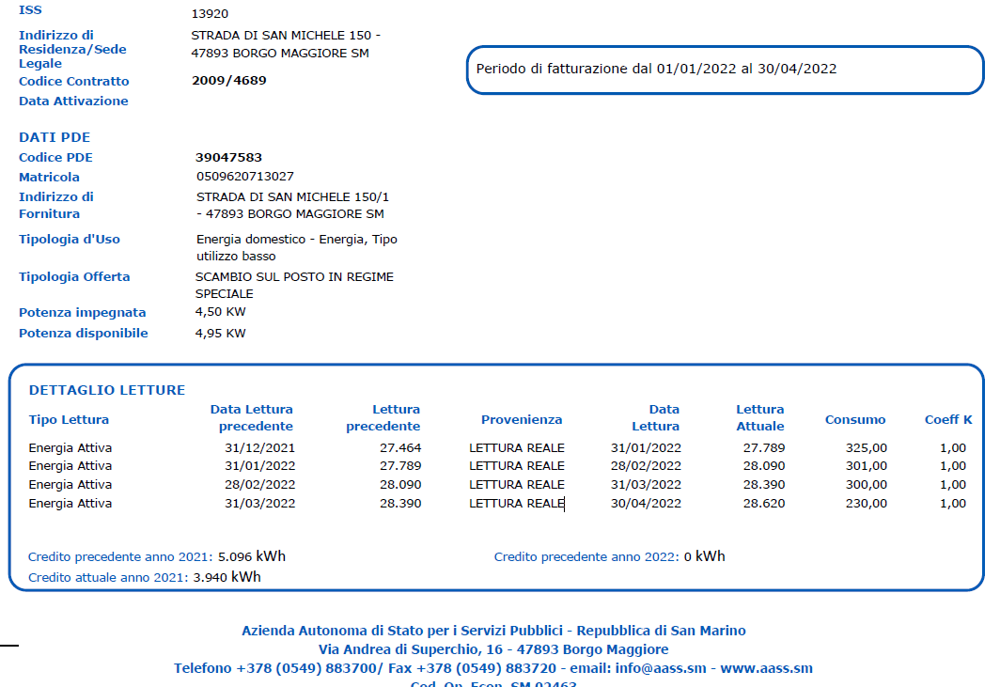
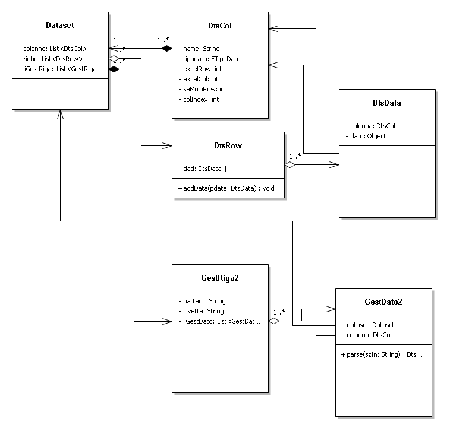

# sinopsis
Il programma viene utilizzato per interpretare le fatture che vengono emessa dalla AASS per le varie forniture di 
- energia elettrica
- gas
- acqua
esempio:

per poi trasferire i campi più importanti su di un foglio Excel
# Dataset
Il Dataset contiene la descrizione delle **colonne** più le **righe** dei dati.

Ogni Dataset viene generato partendo da un file di `properties` che ne descrive la composizione

# Properties
Il file di properties contiene 2 aree
1. Le colonne
2. Le espressioni regolari di ricerca delle colonne

## le colonne
All'interno della espressione regolare che guida l'interpretazione della riga col metodo `DtsCol.parse(String)` metto dei tag `${...}` per identificare i campi che saranno estrapolati. Ogni tag contiene: 
1. il nome del campo
2. la tipologia di campo dal enumerato ETipiDato
3. la riga Excel di destinazione
4. la colonna Excel di destinazione
5. eventuale occorenze se valore tabellare

il metodo interpreta i vari tag e li aggiunge con addField i campi che costruiranno un `DtsCol` dove abbiamo fino a 5 valori separati da ":"
1. nome del campo
2. tipo di dato, vengono arrichiti della RegEx presente nel enum `ETipiDato`
3. colonna in Excel
4. riga in Excel
5. eventuale occorenze se valore tabellare

## le espressioni regolari
Sono le espressioni che identificano la riga da interpretare. 

E' un'espressione regolare Java a tutti gli effetti con l'aggiunta dei campi `${xxx}`.
Ogni campo *deve* far riferimento ad una colonna (descritta sopra), es:
 
	Servizio Energia Elettrica Fattura n. +${FattNo} +Data Emissione ${DataEmiss}.*

Ogni campo verrà cosi ripiazzato dall'espressione regolare riferito alla colonna per ottenere la RegEx finale.
 	
	